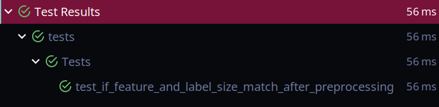

[](https://shields.io/)

<!-- ABOUT THE PROJECT -->
## Fuel efficency app
Convert a ML pipeline defined in a notebook into a robust,
parametrizable Python application with metadata management.

<!-- GETTING STARTED -->
## Getting Started

In this section, I will explain how to get the whole project running on Ubuntu/ macOS.

### Prerequisites
* docker\
  Install docker using this guide: https://docs.docker.com/engine/install/ubuntu/
  ```sh
    sudo apt install docker docker-compose 
  ```

* docker for macOS\
  Install docker using this guide: https://docs.docker.com/docker-for-mac/install/ \
  Run the docker desktop to run the docker daemon

```sh
    brew install docker docker-compose 
```
  
### Installation
1. Clone the repo

##### if you want to run the whole project together
2. make the starting script executable
   ```sh
   sudo chmod +x start_app.sh
   ```
3. run the starting script (you might want to add **sudo** if your docker runs with super user privileges)
   ```sh
   ./start_app.sh
   ```
##### if you want to run the two parts of project separately

2. In one terminal open the current directory (you might want to add **sudo** if your docker runs with super user privileges)
   ```sh
   cd postgres/
   sudo chmod +x docker-entrypoint.sh
   ./docker-entrypoint.sh
   ```
3. In another terminal open the current directory (you might want to add **sudo** if your docker runs with super user privileges)
   ```sh
   cd app/
   sudo chmod +x app-entrypoint.sh
   ./app-entrypoint.sh
   ```
   
<!-- USAGE EXAMPLES -->
## Metadata approach explanation
In practice, usually I don't do model metadata or model storing like this. \
I tired to follow the task as much as possible and that's why I did not apply the approach I work with. 
In practice, I use DVC for this kind of things. DVC allows me to do the model versioning control so if I wanted models 
with accuracy higher than a certain threshold I retrieve the branches (preprocessing and model architecture for code + model)
that meets that condition.\
Thanks to DVC, each model corresponds to a specific branch, and the model will be retrieved automatically (from a cloud storage
such as amazon s3 ) when checking out that branch.\
In machine learning engineering we try multiple combinations and tracking the results of these combinations is beneficial.

### After running the app one time
The auto_mg table looks like this:


The preprocessing metadata looks like this:


The model preprocessing metadata have a foreign key to preprocessing metadata so that wer know which preprocessing and 
model combination allowed us to have that accuracy.\
In addition to that the name of the model is the **model_version + the time the model is created**. The model itself 
is stored using that name so that we can access it directly.
the table looks like this


<!-- USAGE -->
## Description

### Evaluation
After training the model and evaluating with training set, I saved information about the loss, 
validation_loss and execution time by creating a custom callback with tensorflow. Then I plotted these results using 
matplotlib. You may find these plots in the newly created folder in this directory inside **plots** 
folder after running the project.\

### Tests
I implemented a simple unit test in **test.py** file which allows to test the preprocessing class: whether the number of rows
of training features and training label matches, and the number of rows of testing features and testing label matches as
well.


### Note
Actually the archive.ics.uci.edu/ml/ got down for a couple of days which slowed my progress. It is still down until now
and for that reason I chose to download the data from a **mirror** domain directly to work with:
https://data.world/uci.

